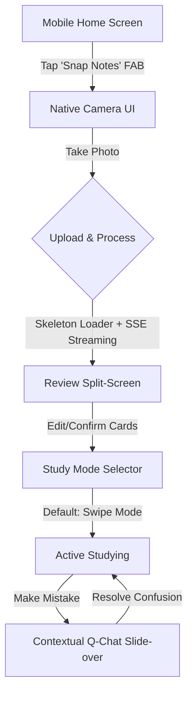
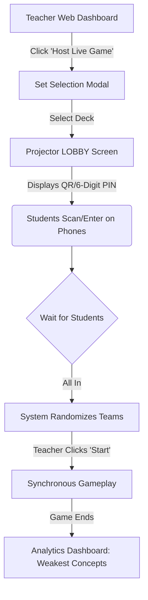

# UX Design Specification my-bmad-project

**Author:** Dovgal
**Date:** 2026-02-20T01:11:51+02:00

---

<!-- UX design content will be appended sequentially through collaborative workflow steps -->

## Executive Summary

### Project Vision

Memora is a modern, offline-first EdTech PWA that eliminates the friction of creating study materials. Its multimodal AI engine instantly transforms handwritten notes and text into interactive flashcards, while elevating the learning experience through contextual AI tutoring (Q-Chat) and a highly engaging, competitive synchronous Live Mode for classrooms.

### Target Users

- **Students:** Mobile-first users who need fast content generation, offline study capabilities, and immediate, context-aware help when making mistakes.
- **Teachers:** Desktop-first users focused on efficiently managing content, orchestrating engaging real-time classroom activities, and analyzing student performance gaps.
- **Parents & Admins:** Secondary users requiring clear dashboards to monitor student progress and enforce content safety/compliance.

### Key Design Challenges

- **Multimodal Upload flow:** Handling the UI/UX for photo capture, OCR processing wait times, and rapid review/revision of generated cards.
- **Dual-Device Live Mode:** Designing a mobile interface for students optimized for speed and competition, paired with a clear, projector-friendly desktop view for teachers.
- **Offline State Communication:** Ensuring students clearly understand when they are studying offline and when their progress will be synced.

### Design Opportunities

- **Delightful AI Transitions:** Highlighting the "magic" of AI generation with smooth micro-interactions that build trust in the automated content.
- **Integrated AI Tutoring:** Placing Q-Chat natively within the study loop (especially after incorrect answers) to provide immediate, context-specific remediation.
- **Classroom Gamification:** Using dynamic scoreboards, team assignments, and real-time feedback to drive engagement during Live Mode sessions.

## Core User Experience

### Defining Experience

The defining user experience of Memora is the "Magic Upload"—the rapid, frictionless transition from raw, unstructured input (like a handwritten photo) to a structured, interactive study set. The secondary core experiences are the embedded AI Tutoring (Q-Chat) and the high-energy, synchronous Live classroom game.

### Platform Strategy

Memora employs a bifurcated platform strategy tailored to user roles:
- **Students (PWA Mobile-First):** Focus on touch targets, offline capabilities, and instant loading. Requires seamless handling of intermittent connectivity.
- **Teachers (Web Desktop-First):** Focus on high information density, keyboard accessibility (WCAG 2.1 AA), and robust tools for classroom orchestration and analytics.

### Effortless Interactions

- **One-Tap Generation:** Taking a photo and initiating AI generation requires no configuration by default.
- **Frictionless Entry:** Students can join Live Mode sessions instantly via QR code without mandatory authentication barriers.
- **Invisible Syncing:** Offline progress automatically syncs in the background upon reconnection without user intervention.

### Critical Success Moments

- **The Magic Reveal:** A student seeing their messy handwriting converted into accurate flashcards within 15 seconds.
- **The Classroom Connection:** The instant a teacher launches a Live Session, and teams are dynamically assigned across dozens of student screens without lag.
- **The "Aha" Moment:** Q-Chat seamlessly intervening right after a missed question to explain the specific concept based on the current context.

### Experience Principles

- **Zero-Friction Creation:** Designing to eliminate all unnecessary steps in the content generation pipeline.
- **Transparent Asynchrony:** Designing loading states for AI and offline synchronization that feel productive rather than blocking.
- **Contextual Specialization:** UIs must adapt heavily to the user's current physical context (e.g., a student on a bus vs. a teacher presenting on a projector).
- **Embedded Remediation:** Assistance must live where the confusion happens, tightly integrated into the study flow.

## Desired Emotional Response

### Primary Emotional Goals

- **For Students - Empowered Delight:** Transforming the typically tedious chore of studying into a fast, magical, and highly engaging experience.
- **For Teachers - Confident Orchestration:** Feeling entirely in control of content creation, classroom energy, and performance analytics without any technical friction.

### Emotional Journey Mapping

- **Discovery (First AI Upload):** Skepticism instantly turning into pleasant surprise and trust as accurate flashcards appear in seconds.
- **Solo Studying:** A state of focused calm. When a mistake is made, frustration is immediately diffused by Q-Chat's gentle, contextual intervention.
- **Live Classroom Mode:** An adrenaline-fueled peak of high energy, friendly competition, and shared excitement.
- **Post-Session Review:** A sense of true accomplishment for students, and insightful preparedness for teachers.

### Micro-Emotions

- **Trust vs. Skepticism:** Crucial when AI reads handwriting. We build trust through transparent UI (e.g., side-by-side OCR review).
- **Accomplishment:** Delivered via quick dopamine hits when finishing a study session or generating a massive deck effortlessly.
- **Belonging:** The feeling of being part of a unified team during synchronous Live games.

### Design Implications

- **Designing for 'Delight':** Use playful micro-interactions and skeleton loaders during the AI "thinking" phase. We should avoid sterile, enterprise-looking loading bars.
- **Designing for 'Support':** Q-Chat should appear organically near the user's mistake with a friendly, non-punitive tone, explicitly avoiding stark "Error/Incorrect" red dialogs.
- **Designing for 'Confident Orchestration':** The teacher's Live Dashboard must be highly organized, legible from a distance (when projected), and use clear, unmistakable visual states for controlling the flow of the game.

### Emotional Design Principles

- **Celebrate the Magic:** Don't hide the AI; make the transition from unstructured input to structured output a visibly celebrated moment in the UI.
- **Diffuse Frustration:** Treat incorrect answers and error states as opportunities for gentle, guided redirection rather than hard failures.
- **Match the Energy:** The UI's visual energy must adapt to its context—clean, calm, and focused for late-night solo study; vibrant, dynamic, and bold for Live classroom mode.

## UX Pattern Analysis & Inspiration

### Inspiring Products Analysis

- **Quizlet:** The industry standard for asynchronous study modes. Excellent mental models for "flipping" cards, but suffers from high friction during manual set creation.
- **Kahoot! / Blooket:** Masters of the synchronous classroom environment. Their use of massive, high-contrast entry codes on the projector and simple, shape-based answering on mobile devices is best-in-class for rapid engagement.
- **Claude / Notion AI:** Exemplars in AI UI/UX. They utilize streaming text and clear "thinking" states to make wait times feel active and productive rather than broken.

### Transferable UX Patterns

**Interaction Patterns:**
- **The "Game PIN / QR" Entry (Kahoot):** For the Live Mode, students should never have to log in. A scan or a 6-digit code on the projector should drop them immediately into a waiting lobby.
- **Generative Streaming (Claude):** When AI is converting handwriting to flashcards, we stream the results in real-time so the user sees the progress, rather than making them wait 15 seconds for a bulk load.
- **Tinder-style Swiping (Flashcards):** For mobile flashcard studying, adopting a card-stack swipe paradigm (Swipe right for "Got it", left for "Study again") is highly intuitive for Gen Z.

**Visual Patterns:**
- **High Contrast / Minimalist (Apple/Vercel):** Clean, dark-mode native aesthetics that focus entirely on the content rather than distracting UI Chrome, elevating Memora above "childish" EdTech competitors.

### Anti-Patterns to Avoid

- **The "Blank Slate" Creator:** Providing users with just empty text boxes for front/back of a card and expecting them to do the work. We must push the AI generation as the primary path.
- **Modal Overload:** Using too many pop-ups or dialog boxes, especially on mobile. Contextual interactions (like Q-Chat) should slide in or expand inline, preserving the user's spatial context.
- **Hidden Offline States:** Letting the user think they are saving progress to the server when they have no connection, only for it to fail silently.

### Design Inspiration Strategy

**What to Adopt:**
- The Kahoot-style frictionless participant joining flow for Live Mode.
- Streaming UI for all generative AI tasks to mask latency.

**What to Adapt:**
- Flashcard studying interactions: Simplify the classic "flip" by adding mobile-native gesture controls (swiping).

**What to Avoid:**
- Cluttered, text-heavy dashboard views on mobile. Mobile must be relentlessly optimized for studying and playing, not administration.

## Design System Foundation

### 1.1 Design System Choice

Themeable Component System utilizing **shadcn/ui** with **Tailwind CSS**.

### Rationale for Selection

- **Accessibility by Default:** Provides WCAG 2.1 AA compliant primitives (via Radix UI) essential for the Teacher administrative tools and broad student access without reinventing complex ARIA states.
- **Total Aesthetic Control:** Since components are copied into the repository rather than installed as an opaque npm package, we have total control to craft the high-contrast, premium, dark-mode aesthetic required, avoiding the "generic" look of older component libraries.
- **Performance:** Relies on utility classes via Tailwind CSS, contributing zero runtime JavaScript styling overhead, crucial for meeting the strict < 2.0s Time-To-Interactive (TTI) requirement for the PWA client.

### Implementation Approach

- **Core Primitives:** We will initialize `shadcn/ui` tailored specifically for Next.js 15 App Router.
- **CSS Variables:** Define the core brand color palette, radiuses, and spacing directly in `app/globals.css` using CSS variables to allow seamless Dark/Light mode switching.

### Customization Strategy

- **Bespoke Animations:** We will extend Tailwind config to include custom keyframes for the "AI Magic" micro-interactions (e.g., scanning sweeps, soft pulsing skeleton loaders).
- **Role-Specific Density:** While underlying components (Buttons, Inputs) are shared, the arrangement strategy will differ: high-density layouts for Teacher Web Dashboard, and large-touch-target, low-density layouts for the Student Mobile PWA.

## 2. Core User Experience

### 2.1 Defining Experience

**The "Magic Upload" (Automated Content Generation)**
The defining interaction of Memora is the frictionless conversion of unstructured data (a photo of handwritten notes or pasted text) into a fully structured, playable study set. This interaction shifts the user's focus from the chore of *data entry* directly to *learning*. 

### 2.2 User Mental Model

- **Current Paradigm (Competitors):** Form-based data entry. Users expect to spend 30-45 minutes typing terms and definitions before they can study.
- **Memora Paradigm:** Instant extraction. Users expect the software to act as a personal assistant that "reads" their notes for them.
- **Potential Friction:** AI skepticism. Users will inherently distrust the generated cards until proven otherwise, fearing hallucinations or missed concepts.

### 2.3 Success Criteria

- **Time-to-Value:** Sub-15 seconds from document upload to the first interactive study action.
- **Trust & Verification:** Users must be able to visually verify the generated cards against their original source material natively within the UI without breaking flow.
- **Zero-Config Default:** The system should require zero configuration (no selecting languages, no defining subjects) to begin generation.

### 2.4 Novel UX Patterns

**Generative Streaming State (Novel):**
Unlike rapid database queries, AI generation takes noticeable time. We will avoid static spinners and instead use a "streaming" UX pattern where users see flashcards appearing sequentially as the AI processes them, making the wait feel active and transparent.

### 2.5 Experience Mechanics

**The Generation Loop:**

1. **Initiation:** User taps a primary floating action button (FAB) on mobile: "Snap Notes".
2. **Interaction (Capture):** Native camera opens → User snaps photo → UI instantly confirms capture and begins background processing (streaming upload to edge).
3. **Feedback (The Wait):** UI transitions to a "Magic in Progress" skeleton screen. As SSE (Server-Sent Events) trigger, cards pop into existence one by one in the preview pane.
4. **Completion (Verification):** A "Review & Save" split-screen appears. Top/Left shows the original photo; Bottom/Right shows the editable card list.
5. **Action:** User taps "Start Studying" and transitions directly into the flashcard swipe view.

## 3. Visual Design Foundation

### 3.1 Color System

**Theme Strategy: Dark-Mode Native**
Memora utilizes a high-contrast, minimalist aesthetic that feels inherently "premium" and focused, distancing itself from the primary-color, cartoonish aesthetics of legacy EdTech tools.

- **Background:** Deep Charcoal (`#0F1115`) for dark mode to reduce eye strain; Crisp Snow (`#FAFAFA`) for light mode.
- **Primary Accent ("AI Magic"):** Electric Indigo/Violet (`#6366F1` to `#8B5CF6`). Used exclusively to highlight primary actions (Upload) and AI-generated content or insights.
- **Semantic Feedback:** 
  - **Success (Swipe Right):** Soft Mint (`#10B981`).
  - **Review Needed (Swipe Left):** Soft Rose (`#F43F5E`).

### 3.2 Typography System

**Typeface: Inter (or Native System UI)**
A highly legible, neo-grotesque sans-serif that ensures absolute clarity across dense teacher dashboards and massive, single-term flashcards.

- **Hierarchy Strategy:**
  - **Flashcard Content:** Extreme scale (`text-4xl` to `text-6xl`) with tight tracking for immediate word recognition.
  - **Teacher Interface:** Dense, utility-driven scale (`text-sm`) with high line-height (`leading-relaxed`) for scanning long lists of students and metrics.
- **Accessibility:** Minimum contrast ratio of 4.5:1 enforced strictly on all text elements, particularly critical for classroom projector environments.

### 3.3 Spacing & Layout Foundation

**Base Grid:** Strict 4px/8px incremental grid (Tailwind CSS defaults).

**Contextual Density:**
- **Mobile (The Student Learner):** High whitespace, massive touch targets (min 48x48px). Flashcards utilize deep, soft drop-shadows to emphasize their physicality and swipability on the Z-axis.
- **Desktop (The Teacher Orchestrator):** Efficient whitespace. Utilization of sidebars, dense data tables, and modal drawers to keep the teacher deeply embedded in their administrative context without losing their place.

### 3.4 Accessibility Considerations

- All interactive elements must support `focus-visible` ring states for keyboard navigation (critical for visually impaired teachers).
- Color must never be the *sole* indicator of success/failure; semantic colors must always be accompanied by an icon or text label.

## Design Direction Decision

### Design Directions Explored

We explored a bifurcated design strategy to accommodate Memora's distinct user personas.
- **Direction 1 (Mobile Student):** "The Magic Native PWA". Dark-mode native, ultra-minimalist, large touch targets, single primary action (Snap Notes FAB).
- **Direction 2 (Desktop Teacher):** "The Orchestrator Dashboard". Light-mode, SaaS-style data density, sidebar navigation, clear tabular analytics.

### Chosen Direction

**The Dual-Interface Approach:**
We will implement *both* directions, united by the shared Tailwind/shadcn design system (Inter typeface, absolute minimalist aesthetic devoid of shadows or gradients outside of primary interactions). 
- The Mobile PWA will enforce the visceral, dark-mode "Magic" aesthetic.
- The Desktop interface will enforce the clean, high-density, accessible administrative aesthetic.

### Design Rationale

Memora serves two entirely different physical contexts. A student studying on a bus in the dark needs high contrast and simple swipe gestures. A teacher projecting a screen to 30 students while reviewing metrics needs dense, scannable data grids. Forcing both into a middle-ground responsive design compromises both experiences.

### Implementation Approach

- **Component Reuse:** We will use `shadcn/ui` components for both interfaces, but apply different Tailwind utility wrapper classes. Mobile will use `p-6` and `rounded-2xl`, while Desktop will use `p-3` and `rounded-md`.
- **Responsive Breakpoints:** The layout shifts dramatically at the `md:` (768px) and `lg:` (1024px) Tailwind breakpoints, transitioning from the Mobile FAB-driven UI to the Desktop Sidebar UI.

## 4. User Journey Flows

### 4.1 The Student: "Magic Upload" & Study Flow
**Goal:** Convert a physical notebook page into a playable flashcard deck and begin studying immediately.
**Optimization:** Bypassing all configuration screens (folder selection, language, visibility) until *after* the value is delivered.

### 4.2 The Teacher: "Live Game Orchestration"
**Goal:** Select a study set and broadcast it to 30 students in the classroom instantly via projector.
**Optimization:** Students must not be forced to log in or create accounts to join a Live session, completely eliminating classroom onboarding friction.

### 4.3 Journey Patterns

Across these flows, we will standardize the following UX patterns:

**1. "Value First, Config Later" Pattern:**
Users receive the core value (generating cards, joining a game) immediately. Metadata configuration (naming the set, choosing a folder, saving an account) happens as an optional, non-blocking step at the end of the journey.

**2. "Contextual Slide-Over" Pattern:**
When users need help (e.g., student using Q-Chat, teacher messaging a struggling student), the UI slides over the current view rather than opening a new page or a blocking modal. This preserves spatial context.

### 4.4 Flow Optimization Principles

- **Zero-Login Guests:** The Live Mode flow is hyper-optimized for anonymous student joins via short-lived Session PINs.
- **Progressive Disclosure:** In the Magic Upload flow, the AI generates the cards, but the user only sees the primary term/definition first. Deep editing tools are hidden behind an explicit "Edit" tap to avoid cognitive overload during the initial review step.

## 5. Component Strategy

### 5.1 Design System Components

The majority of the UI will be constructed using unmodified **shadcn/ui** components configured with the Inter typeface and our defined Tailwind CSS color tokens.

**Core utilized components:**
- `Button`: Standard actions (primary, secondary, ghost). Includes loading states.
- `Dialog` / `Sheet`: Used for settings, set management, and temporary configuration.
- `Table`: The primary display mechanism for Teacher analytics.
- `Toast`: For subtle success/error notifications (e.g., "Set saved offline").

### 5.2 Custom Components

The following components must be built fresh, utilizing `framer-motion` for complex interactions where necessary.

#### 5.2.1 The "SwipeCard" Component
**Purpose:** The primary interaction surface for student studying.
**States:** 
  - `Default`: Top of stack.
  - `Flipped`: Showing definition (via CSS 3D transform).
  - `SwipingLeft` / `SwipingRight`: Interactive spring physics states indicating intended consequence (Know it / Don't know it).
**Accessibility:** Must be navigable via keyboard (Left/Right arrows for swiping, Spacebar for flipping).

#### 5.2.2 The "Generative Skeleton" Component
**Purpose:** Masks AI latency during unstructured data extraction.
**Visuals:** Rather than a spinning circle, it displays empty flashcard silhouettes that "pulse" and fill with blurred text sequentially via Server-Sent Events, teaching the user what the AI is currently doing.

#### 5.2.3 The "LiveGamePIN" Component
**Purpose:** For displaying the 6-digit room code on a projector.
**Visuals:** Extreme typography (e.g., `text-[12vw]`), ultra-high contrast (White text on Deep Charcoal), utilizing tabular numbers to prevent horizontal jitter if the code changes.

#### 5.2.4 "Q-Chat Context Drawer"
**Purpose:** In-flow AI tutoring that doesn't lose the user's place.
**Visuals:** A bottom sheet (mobile) or side sheet (desktop) containing a chat log, a sticky input field, and AI "typing" indicators.

### 5.3 Implementation Strategy

- All custom components will be placed in the `components/custom` directory to explicitly separate them from `components/ui` (the shadcn defaults).
- We will prioritize the `SwipeCard` and `Generative Skeleton` as Phase 1 (MVP) since they block the core "Magic Upload" and learning loops.

## 6. UX Consistency Patterns

### 6.1 Button Hierarchy & Placement

**Mobile (Student PWA):** Bottom-Anchored Dominance
The primary action for any screen (e.g., "Snap Notes", "Save Set", "Next Card") must be an oversized, full-width button fixed to the bottom padding of the viewport. This optimizes for thumb-driven one-handed use on large smartphone screens.

**Desktop (Teacher Web App):** Top-Right Dominance
Primary actions (e.g., "Host Live Game", "Create Class") reside in the top-right corner of the main content view, following established SaaS F-pattern scanning behaviors.

### 6.2 Asynchronous Feedback Patterns

**Non-Blocking "Magic":**
Because AI generation and offline-syncing are core tenets, we strictly avoid modal loading spinners that block user interaction.
- **Data Fetching:** Use shape-matching Skeleton loaders.
- **Background Sync:** Use bottom-left subtle Toast notifications (e.g., "Saved offline").

### 6.3 "Soft Failure" Error Patterns

**Educational Forgiveness:**
In the student-facing PWA, incorrect answers are treated as learning opportunities, not software errors. We refrain from using harsh red (`#F43F5E`) for incorrect study answers, reserving that color strictly for destructive system actions (like deleting an account).
- **Incorrect Answer Pattern:** The card wiggles (spring animation), displays the correct answer in neutral text, and subtly highlights the Q-Chat Tutor button.

### 6.4 The Contextual Slide-Over Pattern

**In-Flow Remediation:**
Dialogs that require the user to reference underlying data (e.g., asking Q-Chat about a specific flashcard, or a Teacher reviewing a specific student's score) must use a Slide-Over Drawer rather than a center-screen Modal.
- **Mobile:** Bottom Sheet (taking up 60-80% of vertical height).
- **Desktop:** Right-side Drawer (taking up 30-40% of viewport width).
This preserves the user's spatial context and allows them to refer back to the underlying material easily.

## 7. Responsive Design & Accessibility

### 7.1 Breakpoint Strategy

Memora utilizes standard Tailwind CSS breakpoints, treating them as functional state changes rather than just visual resizing.

- **Mobile First (Default, `< 768px`):** Assumes the "Student" persona. UI relies on bottom-navigation, swipe gestures, and massive touch targets (min `48x48px`).
- **Tablet (`md: >= 768px`):** Transitional state. Touch targets remain large, but multi-column layouts begin to appear for study sets.
- **Desktop (`lg: >= 1024px`):** Assumes the "Teacher/Orchestrator" persona. Navigation shifts to a persistent left sidebar. Keyboards and cursors are the primary input method. High-density data tables take precedence.

### 7.2 Accessibility Strategy (WCAG 2.1 AA)

- **Contrast:** Strict enforcement of 4.5:1 contrast ratio for all text. The dark-mode charcoal background (`#0F1115`) against pure white text (`#FFFFFF`) provides exceptional contrast without eye strain.
- **Keyboard Navigation:** The Teacher Web App (Desktop breakpoint) guarantees 100% keyboard navigability. All interactive elements must utilize `focus-visible:ring-2 focus-visible:ring-primary` for explicit focus states.
- **Screen Readers:** All icon buttons and complex data visualizations must include `sr-only` descriptions. The `shadcn/ui` foundation natively handles complex ARIA states for Dialogs and Dropdowns.

### 7.3 Testing Strategy

- **Responsive Validation:** Mandatory browser-resizing tests down to 320px (iPhone SE).
- **Accessibility Automation:** CI/CD pipeline must include `eslint-plugin-jsx-a11y` to prevent merging code with missing alt tags or invalid ARIA roles.
- **Manual Audits:** VoiceOver (macOS/iOS) testing required for core flows (Magic Upload, Host Live Session) before major releases.

### 7.4 Implementation Guidelines

- **Relative Units:** Developers must use `rem` for typography to respect operating system font-size preferences, supporting the NFR requirement for 200% zoom capability without breaking layout.
- **Touch Targets:** No clickable element on the Mobile breakpoint can be smaller than `h-12 w-12` (48px) to accommodate all thumb sizes and motor capabilities.

## 6. UX Consistency Patterns

### 6.1 Button Hierarchy & Placement

**Mobile (Student PWA):** Bottom-Anchored Dominance
The primary action for any screen (e.g., "Snap Notes", "Save Set", "Next Card") must be an oversized, full-width button fixed to the bottom padding of the viewport. This optimizes for thumb-driven one-handed use on large smartphone screens.

**Desktop (Teacher Web App):** Top-Right Dominance
Primary actions (e.g., "Host Live Game", "Create Class") reside in the top-right corner of the main content view, following established SaaS F-pattern scanning behaviors.

### 6.2 Asynchronous Feedback Patterns

**Non-Blocking "Magic":**
Because AI generation and offline-syncing are core tenets, we strictly avoid modal loading spinners that block user interaction.
- **Data Fetching:** Use shape-matching Skeleton loaders.
- **Background Sync:** Use bottom-left subtle Toast notifications (e.g., "Saved offline").

### 6.3 "Soft Failure" Error Patterns

**Educational Forgiveness:**
In the student-facing PWA, incorrect answers are treated as learning opportunities, not software errors. We refrain from using harsh red (`#F43F5E`) for incorrect study answers, reserving that color strictly for destructive system actions (like deleting an account).
- **Incorrect Answer Pattern:** The card wiggles (spring animation), displays the correct answer in neutral text, and subtly highlights the Q-Chat Tutor button.

### 6.4 The Contextual Slide-Over Pattern

**In-Flow Remediation:**
Dialogs that require the user to reference underlying data (e.g., asking Q-Chat about a specific flashcard, or a Teacher reviewing a specific student's score) must use a Slide-Over Drawer rather than a center-screen Modal.
- **Mobile:** Bottom Sheet (taking up 60-80% of vertical height).
- **Desktop:** Right-side Drawer (taking up 30-40% of viewport width).
This preserves the user's spatial context and allows them to refer back to the underlying material easily.
